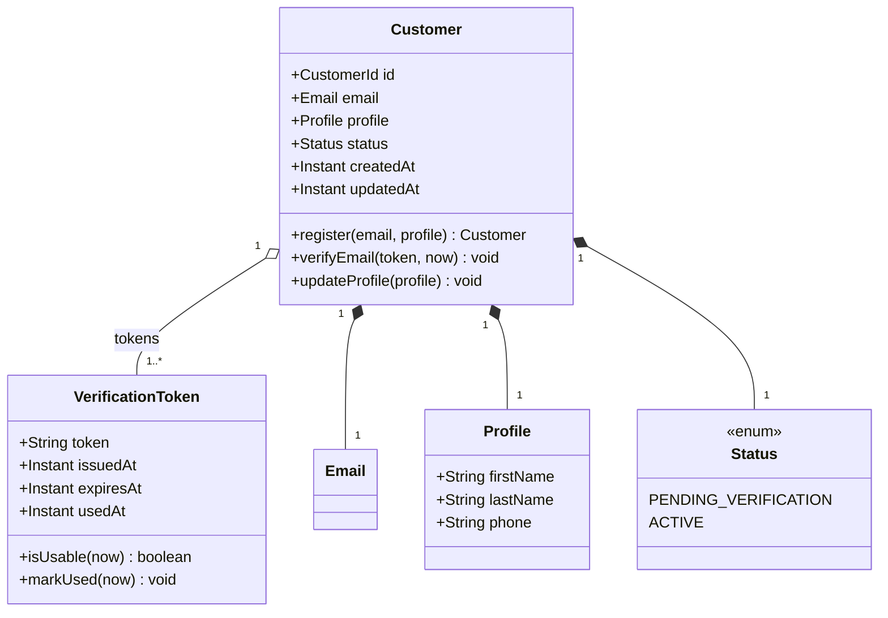
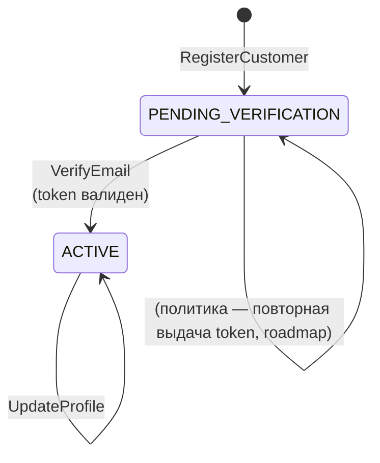

# Агрегат Customer

## 1. Доменная модель

Корень агрегата — `Customer`. В состав агрегата входит коллекция `VerificationToken`-ов: токен живёт только в контексте конкретного Customer, отдельной сущностью наружу не выходит.

### Сущности

| Сущность | Роль | Identity |
|---|---|---|
| Customer | aggregate root | `CustomerId` (uuid v7) |
| VerificationToken | child entity | `token` (opaque string, urlsafe ≥ 22 chars) |

### Value Objects

| VO | Инвариант, который защищает |
|---|---|
| Email | Синтаксически корректный, нормализован к lower-case, длина ≤ 254; неизменяем после создания Customer |
| Name | firstName и lastName — непустые, ≤ 100 символов; не содержат управляющих символов |
| Phone | Опционален; если задан — валиден по E.164 (+<country><number>) |
| Profile | Композиция Name + Phone; всегда консистентна как единое целое |
| VerificationTokenValue | Криптослучайная строка, генерируется secure RNG, TTL ровно 24 часа от выдачи |

### Class-диаграмма

Хранение и индексы — см. [customer-spec.md § 11. Техническая реализация](../customer-spec.md#11-техническая-реализация).

## 2. Жизненный цикл

| Статус | Описание |
|---|---|
| PENDING_VERIFICATION | Создан, владение email не подтверждено |
| ACTIVE | Email подтверждён; полный функционал доступен |

### Матрица переходов

| Откуда | Куда | Триггер (команда / событие / политика) | Эмитит |
|---|---|---|---|
| (нет) | PENDING_VERIFICATION | RegisterCustomer | CustomerRegistered |
| PENDING_VERIFICATION | ACTIVE | VerifyEmail (валидный неистёкший Token) | CustomerEmailVerified |
| ACTIVE | ACTIVE | UpdateProfile | CustomerProfileUpdated |

### State-диаграмма

DEACTIVATED, BANNED — roadmap, не MVP.

## 3. Доступ

Роли определены в [customer-spec.md § 4. Роли и доступ](../customer-spec.md#4-роли-и-доступ).

| Операция | Anonymous | Buyer (self) | Buyer (other) | Service |
|---|---|---|---|---|
| RegisterCustomer | ✓ | ✓ | — | ✓ |
| VerifyEmail (by token) | ✓ | ✓ | ✓ (владение токеном == proof) | ✓ |
| UpdateProfile | ✗ | ✓ | ✗ (403) | ✗ (S2S не редактирует профиль) |
| GetCustomer | ✗ | ✓ | ✗ (403) | ✓ (любой Customer) |

ABAC для Buyer: `sub` из JWT должен совпадать с `customerId` в URL для UpdateProfile / GetCustomer. Иначе 403.

## 4. Бизнес-правила

| Код | Тип | Затрагивает | Описание | Код ошибки |
|---|---|---|---|---|
| BR-C01 | инвариант | RegisterCustomer | Email уникален в пределах Customer BC (нормализованный lower-case) | `EMAIL_ALREADY_REGISTERED` |
| BR-C02 | предусловие | VerifyEmail | VerificationToken найден по значению | `TOKEN_EXPIRED_OR_INVALID` |
| BR-C03 | предусловие | VerifyEmail | VerificationToken ещё не использован (`usedAt == null`) | `TOKEN_EXPIRED_OR_INVALID` |
| BR-C04 | предусловие | VerifyEmail | VerificationToken не истёк (`now < expiresAt`) | `TOKEN_EXPIRED_OR_INVALID` |
| BR-C05 | инвариант | Customer (любой переход) | Status переходит только согласно матрице (§2); прыжки запрещены | `INVALID_STATUS_TRANSITION` |
| BR-C06 | предусловие | UpdateProfile | Customer в статусе ACTIVE | `PROFILE_UPDATE_FORBIDDEN_STATUS` |
| BR-C07 | инвариант | UpdateProfile | Email не меняется через UpdateProfile (поле игнорируется, если придёт) | — |
| BR-C08 | инвариант | Customer | Profile.firstName и Profile.lastName — непустые после создания и любого обновления | `VALIDATION_FAILED` |
| BR-C09 | инвариант | VerificationToken | TTL ровно 24 часа от issuedAt; не настраивается на уровне команды | — |
| BR-C10 | постусловие | RegisterCustomer | Создание Customer и VerificationToken атомарно с записью CustomerRegistered в outbox | — |

## 5. Команды

### RegisterCustomer

- **Переход:** (нет) → PENDING_VERIFICATION.
- **Вход:** `email: Email`, `firstName: String`, `lastName: String`, опц. `phone: Phone`, опц. `Idempotency-Key`.
- **Предусловия:**
  - BR-C01: email не зарегистрирован.
  - BR-C08: firstName / lastName непустые.
- **Логика:**
  1. Нормализовать email к lower-case.
  2. Создать `Customer` с `id = uuidV7()`, `status = PENDING_VERIFICATION`, `createdAt = now`, `updatedAt = now`.
  3. Сгенерировать `VerificationToken` (crypto-random, TTL 24h), привязать к Customer.
  4. Записать Customer + token в БД.
  5. Эмитить `CustomerRegistered` (snapshot) в outbox в одной транзакции.
- **Эмитит:** `CustomerRegistered`.
- **Ошибки:** `EMAIL_ALREADY_REGISTERED` (409), `VALIDATION_FAILED` (400).

### VerifyEmail

- **Переход:** PENDING_VERIFICATION → ACTIVE.
- **Вход:** `token: VerificationTokenValue`.
- **Предусловия:** BR-C02, BR-C03, BR-C04.
- **Логика:**
  1. Найти Customer по token.
  2. Проверить пригодность token-а (не использован, не истёк).
  3. Перевести Customer в ACTIVE, `updatedAt = now`.
  4. Пометить token использованным (`usedAt = now`).
  5. Эмитить `CustomerEmailVerified` в outbox.
- **Эмитит:** `CustomerEmailVerified`.
- **Ошибки:** `TOKEN_EXPIRED_OR_INVALID` (410).

### UpdateProfile

- **Переход:** ACTIVE → ACTIVE.
- **Вход:** `customerId: CustomerId`, `firstName: String`, `lastName: String`, опц. `phone: Phone`, опц. `Idempotency-Key`.
- **Предусловия:** BR-C05, BR-C06, BR-C08; ABAC self-only.
- **Логика:**
  1. Загрузить Customer FOR UPDATE.
  2. Проверить статус ACTIVE.
  3. Обновить Profile, `updatedAt = now`.
  4. Эмитить `CustomerProfileUpdated` (snapshot полного актуального профиля) в outbox.
- **Эмитит:** `CustomerProfileUpdated`.
- **Ошибки:** `FORBIDDEN` (403), `PROFILE_UPDATE_FORBIDDEN_STATUS` (409), `VALIDATION_FAILED` (400), `NOT_FOUND` (404).

## 6. Доменные события

| Событие | Триггер | Scope | Подписчики | Payload (snapshot) |
|---|---|---|---|---|
| CustomerRegistered | RegisterCustomer | внешнее | Notification | `eventId`, `customerId`, `email`, `firstName`, `lastName`, `phone?`, `verificationToken`, `tokenExpiresAt`, `registeredAt` |
| CustomerEmailVerified | VerifyEmail | внешнее | Notification | `eventId`, `customerId`, `email`, `verifiedAt` |
| CustomerProfileUpdated | UpdateProfile | внешнее | Order | `eventId`, `customerId`, `email`, `firstName`, `lastName`, `phone?`, `updatedAt` |

Каждое событие имеет `eventId` (uuid v7) для идемпотентного потребления и `occurredAt` для упорядочивания на стороне consumer'а.

VerificationToken присутствует только в CustomerRegistered и только для Notification — это PII-payload, не реплицируется в другие топики.

## 7. Запросы

### GetCustomer

- **Вопрос:** «каков актуальный профиль Customer?»
- **Параметры:** `customerId: CustomerId`.
- **Возвращает:** `CustomerView` — `id`, `email`, `firstName`, `lastName`, `phone?`, `status`, `createdAt`, `updatedAt`.
- **Логика:**
  - Источник чтения: write-side таблица `customer` (на MVP отдельной read-model нет — нагрузка укладывается, см. [НФТ](../customer-spec.md#10-нефункциональные-требования)).
  - Согласованность: strong.
  - ABAC для Buyer: `sub` == customerId; для Service — без ограничений.
  - 404, если Customer не существует.
