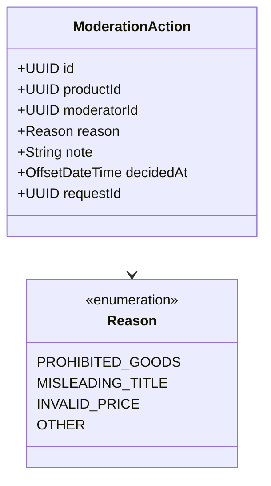

# ModerationAction (домен-юнит)

Сущность контекста Backoffice. На Уровне 2 — **не DDD-агрегат** (нет aggregate root, инварианты проверяются в handler'е, не в модели); плоская иммутабельная модель журнала. Контекст-секции (язык, роли, события-контракт, интеграции) — в [корне `backoffice-spec.md`](../backoffice-spec.md).

## 1. Доменная модель

ModerationAction — запись о решении модератора скрыть товар. Создаётся атомарно с успешным вызовом Catalog API; после создания не изменяется и не удаляется. Хранение (схема, типы) — [корень → Техническая реализация](../backoffice-spec.md#11-техническая-реализация).

| Атрибут | Смысл |
|---|---|
| id | идентификатор записи (генерируется сервером) |
| product_id | логическая ссылка на товар Catalog (без FK) |
| moderator_id | идентификатор модератора (`sub` из JWT) |
| reason | категория нарушения из контролируемого словаря: `PROHIBITED_GOODS`, `MISLEADING_TITLE`, `INVALID_PRICE`, `OTHER` |
| note | свободный комментарий модератора (опционально) |
| decided_at | момент принятия решения (серверный) |
| request_id | client-supplied UUID для идемпотентности команды |

Инварианты (полностью — [Бизнес-правила](#4-бизнес-правила)): запись иммутабельна; `reason` — из словаря; `product_id` и `moderator_id` — обязательны; `request_id` — уникален.

## 2. Жизненный цикл

ModerationAction — иммутабельный журнал. Жизненный цикл вырожденный.

| Из | В | Триггер |
|---|---|---|
| (нет) | `CREATED` | `HideProductByModeration` (после успешного вызова Catalog) |

Удаление или редактирование не предусмотрены. Откат решения модератора (если товар вернули в `PUBLISHED`) выполняется продавцом в Catalog или новой `ModerationAction` другого модератора и **не** удаляет историческую запись.

## 3. Доступ

Роли и общие ABAC-правила — [корень → Роли и доступ](../backoffice-spec.md#4-роли-и-доступ).

| Операция | moderator (владелец) | admin |
|---|---|---|
| `HideProductByModeration` | ✅ (от своего имени) | ✅ |
| `ListMyModerationActions` | ✅ только свои | ✅ только свои |
| `ListModerationActions` (любой модератор) | — | ✅ |
| `GetModerationAction` (одна запись) | ✅ только свою | ✅ любую |

Изменяющая команда `HideProductByModeration` фиксирует `moderator_id` из токена; на чтении не-admin видит только записи с `moderator_id == sub`. Admin обходит ABAC.

## 4. Бизнес-правила

| Код | Тип | Правило | Команда | Ошибка |
|---|---|---|---|---|
| BR-M01 | инвариант | `reason` обязательна и принадлежит словарю `{PROHIBITED_GOODS, MISLEADING_TITLE, INVALID_PRICE, OTHER}` | HideProductByModeration | `INVALID_REASON` |
| BR-M02 | инвариант | `product_id` и `moderator_id` обязательны и не пусты | HideProductByModeration | — (валидация входа) |
| BR-M03 | инвариант | `note` — опционален, ≤ 1000 символов | HideProductByModeration | `INVALID_NOTE` |
| BR-M04 | предусловие | Запись создаётся только при успешном ответе Catalog `HideProduct` (200) | HideProductByModeration | транслируется код Catalog |
| BR-M05 | инвариант | Идентификатор всегда серверный (`id` от клиента не принимается) | HideProductByModeration | — |
| BR-M06 | инвариант | Запись иммутабельна — нет команд `Update`/`Delete` | — | — |
| BR-M07 | предусловие | Команда идемпотентна по `request_id` — повторный запрос с тем же `Idempotency-Key` возвращает сохранённый результат, не создаёт новую запись | HideProductByModeration | — |

## 5. Команды

### `HideProductByModeration`
- **Переход:** (нет) → `CREATED`
- **Вход:** product_id, moderator_id (из токена), reason, note?, request_id (из заголовка `Idempotency-Key`)
- **Предусловия:** `reason` ∈ словарь (`BR-M01`); `note.length ≤ 1000` (`BR-M03`); ранее с этим `request_id` команда не выполнялась — иначе вернуть сохранённый результат (`BR-M07`)
- **Логика:** вызвать `HideProduct(product_id)` в Catalog с admin-токеном; при ответе 200 — сохранить `ModerationAction` (серверный id и decided_at) и запись в `idempotency_records`; при ответе Catalog 409/404/5xx — пробросить, ничего не сохранять
- **Ошибки:** `INVALID_REASON`, `INVALID_NOTE`, `PRODUCT_ALREADY_HIDDEN`, `PRODUCT_NOT_FOUND`, `CATALOG_UNAVAILABLE`

## 6. Доменные события

ModerationAction не публикует доменных событий (Уровень 2; см. [корень → Доменные события](../backoffice-spec.md#5-доменные-события)).

## 7. Запросы

### `GetModerationAction`
- **Вопрос:** какие детали у конкретного решения модерации?
- **Параметры:** action_id; контекст запрашивающего (владелец / admin)
- **Возвращает:** запись если запрашивающий — владелец или admin; иначе «не найдено»
- **Логика:** чтение по PK из `moderation_actions`; правило видимости из [Доступ](#3-доступ); строгая согласованность

### `ListMyModerationActions`
- **Вопрос:** какие решения принял текущий модератор?
- **Параметры:** moderator_id (из токена), from?, to?, page, size
- **Возвращает:** страница записей модератора, отсортированных по `decided_at desc`
- **Логика:** чтение по `(moderator_id, decided_at)` индексу; опциональный диапазон дат; пагинация (page 1-based)

### `ListModerationActions` (admin)
- **Вопрос:** какие решения принимали модераторы за период?
- **Параметры:** moderator_id?, from?, to?, reason?, page, size
- **Возвращает:** страница записей по фильтру
- **Логика:** чтение по `decided_at desc`; доступна только роли `admin`; пагинация
