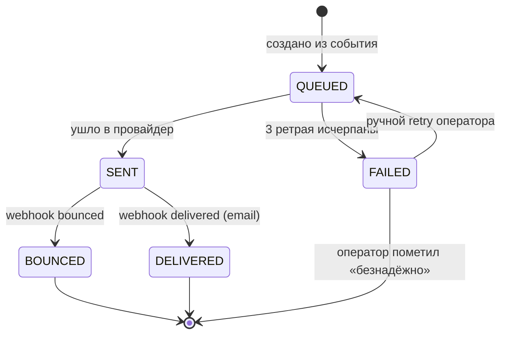

# Notification (домен-юнит)

Сущность контекста Notification. На Уровне 1 — **не DDD-агрегат** (anemic, строка в таблице; логика в сервисе/шедулерах). Контекст-секции (язык, роли, интеграции, события-контракт) — в [корне `notification-service-spec.md`](../notification-service-spec.md).

## 1. Доменная модель

Уровень 1 — модель = **таблицы** (агрегатов/VO нет; проектное решение). Контроллер/сервис принимают JSON-DTO напрямую.

| Таблица | Роль |
|---|---|
| `notifications` | главная: строка = попытка доставки в один канал; копия контакта и шаблонных переменных на момент отправки |
| `templates` | шаблоны (`<event>.<channel>` × locale): субъект + тело с `${var}` |
| `delivery_attempts` | лог каждой попытки (изолирован от `notifications` — запросы по статусу по индексу) |
| `processed_events` | идемпотентность консьюмера (PK по `event_id`) |

Схема (ER, типы, индексы) — [корень → Техническая реализация](../notification-service-spec.md#11-техническая-реализация).

## 2. Жизненный цикл уведомления

| Статус | Описание |
|---|---|
| `QUEUED` | создано из события, ждёт отправки |
| `SENT` | ушло в провайдер |
| `DELIVERED` | webhook `delivered` (только email) |
| `BOUNCED` | webhook `bounced` |
| `FAILED` | ретраи исчерпаны / permanent error |

Терминальные: `DELIVERED`, `BOUNCED`, `FAILED` (после ручной отметки). PUSH без webhook → остаётся `SENT` (`BR-N7`). Ручной retry — только из `FAILED`.

## 3. Доступ

Роли и общие правила — [корень → Роли и доступ](../notification-service-spec.md#4-роли-и-доступ).

| Операция | support-operator | system |
|---|---|---|
| `GET /notifications`, `/{id}` | ✅ | — |
| `POST /{id}/retry`, `/{id}/abandon` | ✅ | — |
| `POST /webhooks/email-events` | — | ✅ (HMAC) |

ABAC отсутствует — оператор видит все уведомления.

## 4. Бизнес-правила

- **`BR-N1`** — *инвариант.* Идемпотентность по `event_id` (`processed_events`, `INSERT … ON CONFLICT DO NOTHING`).
- **`BR-N2`** — *политика.* Каналы по типу события (таблица в коде): `OrderConfirmed`/`OrderPaid`/`OrderShipped`/`OrderCancelled`/`OrderRefunded`/`DisputeResolved` → email+push; `OrderDelivered` → email; `DisputeOpened` → push продавцу + email оператору.
- **`BR-N3`** — *инвариант.* Нет шаблона для `(event, channel, locale)` → уведомление не создаётся + `notification_template_missing_total`.
- **`BR-N4`** — *инвариант.* Контакт материализуется на момент отправки.
- **`BR-N5`** — *политика.* Retry 3 попытки (30s/5min/30min) при `TRANSIENT_ERROR`; `PERMANENT_ERROR` → сразу `FAILED`.
- **`BR-N6`** — *инвариант.* Дедупликация webhook по `(notification_id, webhook_event_id)`.
- **`BR-N7`** — *инвариант.* PUSH без подтверждения: 200 от FCM → `SENT`, не переходит в `DELIVERED`.
- **`BR-N8`** — *политика.* TTL журнала 90 дней (152-ФЗ/GDPR).
- **`BR-N9`** — *политика.* ≤ 100 писем/сек на провайдера (token bucket).

## 5. Команды (операции)

Уровень 1 — операции сервиса/шедулеров, не `UseCase`-классы.

### `ProcessOrderEvent`
- **Триггер:** Kafka `marketplace.orders.v1` · **Предусловия:** `BR-N1`, `BR-N3`
- **Логика:** проверить `event_id`; запросить контакт у Customer BFF; по таблице каналов (`BR-N2`) создать записи `QUEUED`.
- **Ошибки:** `CONTACT_LOOKUP_FAILED` (→ `FAILED` после ретраев), `TEMPLATE_MISSING` (не создаётся)

### `DispatchPending`
- **Триггер:** шедулер (1с) · **Логика:** взять `QUEUED` (≤100), отрендерить, отправить, обновить статус; при ошибке — `delivery_attempts` + retry (`BR-N5`).

### `ProcessEmailWebhook`
- **Триггер:** webhook Mailgun · **Предусловия:** HMAC (`BR-N6`) · **Логика:** по `external_id` → `DELIVERED`/`BOUNCED`.
- **Ошибки:** `WEBHOOK_SIGNATURE_INVALID`

### `RetryNotification`
- **Актор:** support-operator · **Переход:** `FAILED` → `QUEUED` · **Ошибки:** `NOTIFICATION_NOT_FOUND`, `INVALID_STATUS_FOR_RETRY`

### `AbandonNotification`
- **Актор:** support-operator · **Переход:** `FAILED` → `FAILED` (финальный, без retry)

### `PurgeOldRecords`
- **Триггер:** шедулер (ежедневно) · **Логика:** удалить записи старше 90 дней (`BR-N8`).

## 6. Доменные события

**Не применимо на Уровне 1.** Сервис событий не публикует (см. [корень → Доменные события](../notification-service-spec.md#5-доменные-события)).

## 7. Запросы

### `SearchNotifications`
- **Актор:** support-operator · **Параметры:** `userId?`, `status?`, `eventType?`, `channel?`, период, пагинация
- **Возвращает:** страницу уведомлений · **Логика:** SELECT поверх `notifications` (Read Model нет).

### `GetNotification`
- **Актор:** support-operator · **Параметры:** `id` · **Возвращает:** запись + `delivery_attempts`.

### `GetUserInbox`
- **Актор:** Customer BFF (s2s) · **Параметры:** `userId`, пагинация · **Возвращает:** уведомления пользователя по дате.
