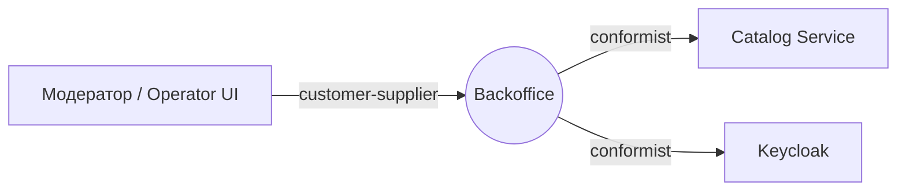
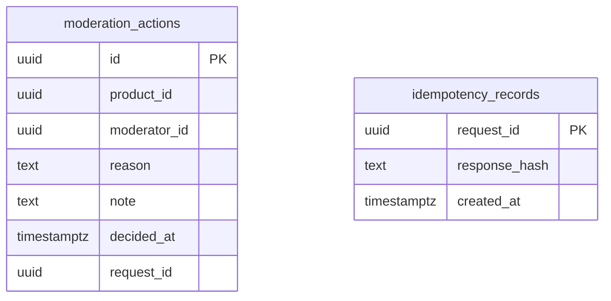

# Backoffice Service — Use Case спецификация (Уровень 2)

Контекст **Backoffice** маркетплейс-кейса: оператор маркетплейса просматривает опубликованные карточки товаров и принудительно скрывает нарушающие правила. Уровень 2: `usecase-pattern` (UseCase + Handler с CQRS-маркерами), без DDD-агрегатов, доменных событий, саг и hexagonal-разделения. Агрегатов нет; домен-юнит — сущность **ModerationAction** — в [`aggregates/moderation-action.md`](aggregates/moderation-action.md). Этот файл — секции уровня контекста.

## 1. Bounded Context

**Контекст:** Backoffice. **Субдомен:** Supporting — обеспечивает безопасность витрины, но не несёт ядровую сложность маркетплейса. **Владелец:** команда «Бэк-офис». **Миссия:** дать операторам инструмент модерации публичного каталога с полным аудитом каждого действия.

### Домен-юниты

| Юнит | Назначение | Файл |
|---|---|---|
| `ModerationAction` (сущность) | Иммутабельная запись о решении модератора по конкретному товару | [`aggregates/moderation-action.md`](aggregates/moderation-action.md) |

### В границе контекста

- Просмотр очереди опубликованных карточек товаров для модерации.
- Принудительное скрытие нарушающей карточки через Catalog API.
- Запись решения модератора (`ModerationAction`) с причиной и ссылкой на товар.
- Просмотр истории действий модератора (audit-по-факту).

### Вне границы

- **Сам каталог товаров** — Catalog Service (источник правды по карточкам).
- **Разбор споров между покупателем и продавцом** — кандидат на расширение Backoffice / отдельный контекст Dispute; в скоупе демо не нужен.
- **Блокировка продавцов** — Customer Service.
- **Возвраты и компенсации** — Payment Service.
- **Самостоятельное правление данных** — Backoffice не пишет в чужие БД; все изменения проходят через API сервиса-владельца.
- **Аутентификация модератора** — IdP (Keycloak).

### Стыки с соседями

| Сосед | Тип связи | Суть |
|---|---|---|
| Catalog Service | conformist (Backoffice — consumer) | читает очередь PUBLISHED-товаров; вызывает HideProduct admin-токеном |
| Backoffice UI / Operator BFF | customer-supplier (Backoffice — supplier) | команды модератора + чтение собственной истории |
| Keycloak | conformist | Backoffice принимает контракт токена как есть |

## 2. Интеграции (Context Map)

| Ребро | Направление | Канал | Связь | Контракт |
|---|---|---|---|---|
| Operator UI → Backoffice | inbound | sync | customer-supplier (ohs) | [`backoffice.openapi.yaml`](../../src/main/resources/openapi/backoffice.openapi.yaml) |
| Backoffice → Catalog | outbound | sync | conformist | [Catalog OpenAPI](../../../catalog/src/main/resources/openapi/catalog.openapi.yaml) |
| Backoffice → Keycloak | outbound | sync | conformist | OIDC / JWKS |

### Контракты

- REST (входящий, владелец — Backoffice): `src/main/resources/openapi/backoffice.openapi.yaml`.
- REST (исходящий, владелец — Catalog): `GetProduct`, `ListProducts`, `HideProduct` — Backoffice вызывает с admin-ролью токена.
- Async: **нет**. Backoffice не публикует доменных событий и не подписывается — Kafka-топиков нет (см. [Доменные события](#5-доменные-события)).

## 3. Ubiquitous Language

| Термин | Определение |
|---|---|
| **Moderator** | Сотрудник маркетплейса с ролью `moderator`. Просматривает каталог и принимает решения о скрытии нарушающих карточек. |
| **ModerationAction** | Иммутабельная запись о решении модератора: какой товар, кто решил, причина, момент. Создаётся атомарно вместе с вызовом Catalog API. |
| **Reason (причина скрытия)** | Категория нарушения, выбранная модератором из контролируемого словаря (`PROHIBITED_GOODS`, `MISLEADING_TITLE`, `INVALID_PRICE`, `OTHER`). Поле `note` — свободный комментарий. |
| **Очередь модерации** | Логическое представление: список PUBLISHED-карточек Catalog, отсортированный по `published_at desc`. Не отдельная сущность — построение по запросу из Catalog API. |

**Намеренно нет:** Dispute, Refund, Ban (см. [границы](#1-bounded-context)); Aggregate / Value Object / Domain Event — это Уровень 3, в Backoffice избыточно.

## 4. Роли и доступ

| Роль | Кто это |
|---|---|
| `moderator` | модератор; имеет право скрывать чужие товары и видит свою историю |
| `admin` | те же операции для любого модератора (включая чужую историю) |

**Общий ABAC:** идентификатор модератора из токена (`sub`) фиксируется в `ModerationAction.moderator_id` и в admin-токене Catalog (как actor). `moderator` видит только свои действия; `admin` обходит. Доступ по операциям — в матрице [`aggregates/moderation-action.md` → Доступ](aggregates/moderation-action.md#3-доступ).

**PII:** Backoffice не хранит персональных данных покупателей или продавцов — только `moderator_id` (служебный идентификатор оператора из IdP).

## 5. Доменные события

**Не применимо на Уровне 2.** Backoffice не публикует доменных событий и не подписывается. Изменение статуса товара (`PUBLISHED → HIDDEN`) — синхронный эффект вызова Catalog API внутри команды; соседи наблюдают через Catalog как через единственный источник правды.

## 6. Use Cases

### UC-B1 — Модератор скрывает нарушающий товар

**Актор:** moderator. **Поток:** открывает очередь модерации → `ListModerationQueue` (страница PUBLISHED-карточек из Catalog) → выбирает товар, выбирает категорию причины → `HideProductByModeration` (вызов `HideProduct` в Catalog admin-токеном; при успехе — запись `ModerationAction` локально). **Альтернативы:** Catalog отвечает `INVALID_STATE_TRANSITION` (товар уже скрыт продавцом или другим модератором) — `ModerationAction` не пишется, оператор видит «уже скрыт». Команды — [`aggregates/moderation-action.md`](aggregates/moderation-action.md#5-команды).

### UC-B2 — Модератор смотрит свою историю

**Актор:** moderator. **Поток:** `ListMyModerationActions` → страница своих записей `ModerationAction`, отсортированных по `decided_at desc`. **Альтернативы:** нет — пустой результат при отсутствии действий.

### UC-B3 — Admin смотрит историю любого модератора

**Актор:** admin. **Поток:** `ListModerationActions` с фильтром по `moderator_id`, `from`, `to` → страница записей. Для аудита и расследований инцидентов.

## 7. Процессы

**Не применимо на Уровне 2.** Кросс-агрегатных процессов и распределённых транзакций нет. Каждая команда модератора — одна локальная транзакция Backoffice (запись `ModerationAction`) **и** один синхронный HTTP-вызов в Catalog. Согласованность — best effort: если Catalog ответил 200, но локальная запись упала, оператор увидит ошибку и повторит; идемпотентность по `request_id` (см. [Техническая реализация](#11-техническая-реализация)).

## 8. UI-спецификация

Backoffice предоставляет минимальное API; UI собирается на стороне Operator BFF / SPA.

| Состояние товара (в Catalog) | Бейдж в очереди | Действие |
|---|---|---|
| `PUBLISHED` | «На модерации» | доступно `Hide` |
| `HIDDEN` | (не виден в очереди) | — |
| `DRAFT` | (не виден в очереди) | — |

| Ситуация | Текст пользователю |
|---|---|
| Товар уже скрыт (продавцом или другим модератором) | Товар уже не опубликован. |
| Catalog недоступен | Сервис каталога временно недоступен, повторите позже. |
| Причина не выбрана | Выберите категорию причины. |
| Товар не найден | Товар не найден. |

## 9. Критерии приёмки

| AC | Given / When / Then |
|---|---|
| AC-B1 | **Given** опубликованный товар в Catalog; **When** модератор скрывает его с причиной `PROHIBITED_GOODS`; **Then** Catalog отдаёт 200 и переводит карточку в `HIDDEN`, в Backoffice появляется `ModerationAction` с moderator_id и причиной. |
| AC-B2 | **Given** товар уже `HIDDEN`; **When** модератор пытается скрыть его; **Then** Catalog возвращает 409, `ModerationAction` не создаётся, оператор видит «уже не опубликован». |
| AC-B3 | **Given** модератор с N собственными действиями; **When** запрашивает свою историю; **Then** видит ровно N записей, отсортированных по `decided_at desc`, с пагинацией. |
| AC-B4 | **Given** модератор A; **When** запрашивает историю модератора B без admin-роли; **Then** получает 403. |
| AC-B5 | **Given** admin; **When** запрашивает историю любого модератора с фильтром по периоду; **Then** видит записи только в указанном диапазоне. |
| AC-B6 | **Given** команда скрытия с пустым `reason`; **When** отправлена; **Then** 400 «Выберите категорию причины», ничего не записано, Catalog не вызван. |
| AC-B7 | **Given** Catalog недоступен; **When** модератор скрывает товар; **Then** 503, `ModerationAction` не создаётся; повторный запрос с тем же `request_id` идемпотентен. |

## 10. Нефункциональные требования

| Атрибут | Цель |
|---|---|
| Производительность (чтение) | `ListMyModerationActions` p95 ≤ 80ms |
| Производительность (запись) | `HideProductByModeration` p95 ≤ 300ms (включает синхронный вызов Catalog) |
| Капасити | ~10 RPS чтение, ~1 RPS запись — модерация ручная, не массовая |
| Доступность | stateless Backoffice; при недоступности Catalog команды модерации недоступны, чтение собственной истории работает |
| Согласованность | строгая в локальной транзакции; межсервисная — read-time, синхронно через Catalog |
| Безопасность | JWT (OAuth2 Resource Server); роль `moderator` обязательна; ABAC по `moderator_id`; admin-токен на исходящий Catalog с пометкой `acting_as: moderator` в audit |
| Наблюдаемость | метрики `moderation_actions_total{reason}`, `catalog_hide_call_duration_seconds`, error rate; `moderator_id`/`product_id`/`request_id` в логах |
| Эксплуатация | миграции без рестарта; идемпотентность команд по `request_id` (header `Idempotency-Key`) |

## 11. Техническая реализация

Единственный технический раздел; всё выше — домен.

**Контейнеры (C2):** один контейнер — Spring Boot Backoffice; внешнее состояние — PostgreSQL; внешние зависимости — Catalog Service (HTTP) и Keycloak (JWKS).

| Слой | Стек | Реализация |
|---|---|---|
| Платформа | Java 21, Spring Boot 3.4.x | single-module, без hexagonal |
| REST (входящий) | Spring Web | контроллеры реализуют операции OpenAPI; маппинг DTO ↔ UseCase; ABAC через `@PreAuthorize` |
| REST (исходящий) | Spring RestClient + Resilience4j | `CatalogClient` с Circuit Breaker, Retry (только на идемпотентных кодах ошибок), Timeout |
| Безопасность | Spring Security, OAuth2 Resource Server | JWT по JWK Keycloak; роли из `realm_access.roles`; профили `local`/`integration-test` — `permitAll` |
| Бизнес-операции | `ru.vikulinva:usecase-pattern` | `UseCaseCommand`/`UseCaseQuery` (record) + `UseCaseHandler` (`@Component`, `@Transactional`) + `UseCaseDispatcher`; валидация входа — в Handler |
| Persistence | spring-boot-starter-jooq, nu.studer.jooq | **только jOOQ, только generated** (`ModerationActionsPojo`, generated enum причин) |
| БД | PostgreSQL 16, Liquibase | схема через `migrations/db/changelog/v-X.Y/` |
| Идемпотентность | таблица `idempotency_record(request_id PK, response_hash, created_at)` | по `Idempotency-Key` из заголовка; TTL 24h |
| Ошибки | RFC 9457 ProblemDetails | `@RestControllerAdvice` маппит доменные исключения; ошибки Catalog транслируются в свои коды |
| Наблюдаемость | Micrometer + Prometheus, OpenTelemetry | метрики и span'ы; трейс прокидывается в Catalog через `traceparent` |
| Тесты | JUnit 5 + Testcontainers + WireMock | против реального Postgres; Catalog мокается WireMock'ом |

Group `ru.remodov`. Catalog-клиент генерируется openapi-generator'ом из контракта `catalog.openapi.yaml` (target `spring-restclient`).

### Коды ошибок → HTTP

| `code` | HTTP | Когда |
|---|---|---|
| `MODERATION_ACTION_NOT_FOUND` | 404 | запрошенная запись не существует или принадлежит другому модератору (без admin) |
| `INVALID_REASON` | 400 | `reason` пуст или не входит в контролируемый словарь |
| `PRODUCT_ALREADY_HIDDEN` | 409 | Catalog ответил `INVALID_STATE_TRANSITION` — товар не в `PUBLISHED` |
| `PRODUCT_NOT_FOUND` | 404 | Catalog ответил 404 |
| `CATALOG_UNAVAILABLE` | 503 | Catalog недоступен (Circuit Breaker open или timeout) |
| `INTERNAL_SERVER_ERROR` | 500 | непредвиденная ошибка |

### Схема БД

Две таблицы. Индекс по `(moderator_id, decided_at desc)` для `ListMyModerationActions`; индекс по `decided_at desc` для admin-листинга; уникальный индекс `request_id` для идемпотентности. Cross-context ссылка `product_id → catalog.products.id` — **логическая, без FK** (Catalog в другом контексте). `request_id` — UUID v7 (или v4), передаётся клиентом в заголовке `Idempotency-Key`.
