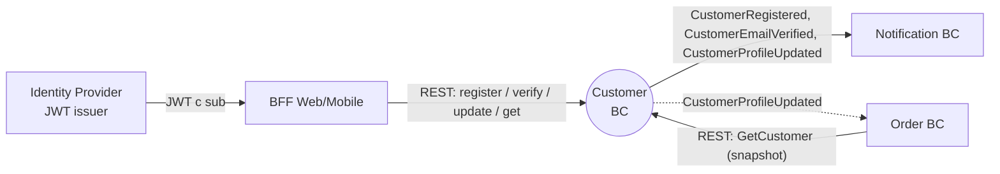

# Customer — Use Case спецификация (Уровень 3: DDD + Hexagonal)

## 1. Bounded Context

- **Контекст:** Customer.
- **Субдомен:** Supporting — поддерживает основной поток покупок, но сам по себе не источник конкурентного преимущества маркетплейса.
- **Владелец:** команда customer-сервиса.
- **Миссия:** хранить идентичность покупателя (Buyer) и гарантировать, что для каждого подтверждённого email существует ровно один активный Customer, доступный для snapshot-копирования соседним контекстам.

### Агрегаты

| Агрегат | Файл | Назначение |
|---|---|---|
| Customer | [aggregates/customer.md](aggregates/customer.md) | Идентичность покупателя: email, профиль, статус верификации |

### Внутри границы

- Регистрация покупателя по email + базовому профилю.
- Подтверждение владения email через одноразовый Verification Token.
- Обновление профиля (имя, фамилия, телефон) самим покупателем.
- Чтение Customer соседними контекстами для snapshot-копирования.

### Вне границы

- Аутентификация и выпуск access/refresh-токенов — внешний IdP.
- Авторизационная модель ролей и permission'ов — внешний IdP / API Gateway.
- Адреса доставки — отдельный контекст (Address / Order).
- Согласия (privacy / marketing consent) — roadmap, не MVP.
- История заказов, корзина, профиль продавца — другие контексты.
- Смена email и сброс пароля — roadmap (требуют отдельной верификации).

### Стыки

- **Identity Provider** — `conformist` (Customer подстраивается под формат `sub` из JWT IdP).
- **Notification** — `published-language` (Customer публикует CustomerRegistered / CustomerEmailVerified, Notification потребляет).
- **Order** — `customer-supplier` (Customer как supplier отдаёт snapshot Customer; Order как customer обязуется не лезть напрямую в БД).
- **BFF (Web/Mobile)** — `ohs` (открытый REST API для UI).

## 2. Интеграции (Context Map)



### Рёбра

| От | К | Направление | Канал | Связь | Что передаётся |
|---|---|---|---|---|---|
| BFF | Customer | inbound | sync | ohs | команды RegisterCustomer, VerifyEmail, UpdateProfile; запрос GetCustomer |
| Customer | Notification | outbound | async | published-language | CustomerRegistered, CustomerEmailVerified |
| Customer | Order | outbound | sync+async | customer-supplier | sync: GetCustomer (REST); async: CustomerProfileUpdated (snapshot) |
| IdP | Customer | inbound | sync | conformist | JWT с `sub` — внешний идентификатор покупателя, маппится на Customer.id |

### Контракты

- REST: [docs/api/customer.openapi.yaml](../api/customer.openapi.yaml) — owner: customer.
- AsyncAPI: [docs/api/customer.asyncapi.yaml](../api/customer.asyncapi.yaml) — owner: customer.

## 3. Ubiquitous Language

| Термин | Код | Определение |
|---|---|---|
| Customer | Customer | Покупатель маркетплейса; владеет email и профилем; имеет единственного владельца — Customer BC |
| Buyer | — | Роль актора (покупатель в платёжном/order-контексте). Внутри Customer BC всегда соответствует одному Customer |
| Email | Email | Электронная почта, идентифицирующая Customer; уникальна в рамках BC |
| Verification Token | VerificationToken | Одноразовый код подтверждения владения email; TTL 24 часа |
| Profile | Profile | Имя, фамилия, телефон Customer; редактируется через UpdateProfile |
| Status | Status | Стадия жизненного цикла Customer: PENDING_VERIFICATION → ACTIVE |
| Snapshot | — | Копия данных Customer на момент события, передаваемая в payload-е во внешний контекст |

**Не путать:**
- Customer ≠ User в смысле IdP. IdP управляет учётной записью и паролем; Customer хранит маркетплейс-профиль и факт верификации email.
- Customer ≠ Buyer-роль. Buyer — это роль актора на платформе; Customer — entity внутри одного BC.
- Email-смена ≠ UpdateProfile. UpdateProfile не меняет Email (см. бизнес-правила агрегата).

## 4. Роли и доступ

| Роль | Происхождение | Описание |
|---|---|---|
| Anonymous | без аутентификации | Незарегистрированный посетитель — может вызывать RegisterCustomer и VerifyEmail |
| Buyer | JWT IdP (`sub` = Customer.id) | Зарегистрированный Customer — может читать и обновлять свой профиль |
| Service | service-to-service (client_credentials) | Другие BC (Order, Notification) — могут читать GetCustomer любого Customer для snapshot |

### Общие ABAC-правила

- **Self-only access**: Buyer может оперировать только тем Customer, чей id совпадает с `sub` из его JWT. Несовпадение → 403.
- **VerificationToken == proof**: владение валидным VerificationToken доказывает владение email; роль для VerifyEmail не требуется.

### PII

- Email, firstName, lastName, phone — PII. В логи не пишутся открытым текстом (см. R-OBS-* style-guide); из событий вычищаются на стороне consumer'ов, если те не имеют права на PII.

Матрицы доступа к конкретным командам / запросам — в [aggregates/customer.md § 3. Доступ](aggregates/customer.md#3-доступ).

## 5. Доменные события

Публикуемый язык Customer BC. Полные payload-ы и триггеры — у агрегата (см. [aggregates/customer.md § 6. Доменные события](aggregates/customer.md#6-доменные-события)).

| Агрегат | Событие | Внешний топик | Подписчики |
|---|---|---|---|
| Customer | CustomerRegistered | `customer.events.v1` | Notification (welcome email + verification link) |
| Customer | CustomerEmailVerified | `customer.events.v1` | Notification (welcome-confirmed) |
| Customer | CustomerProfileUpdated | `customer.events.v1` | Order (обновление snapshot покупателя) |

Все события идут через Transactional Outbox (см. §11) — at-least-once delivery, идемпотентны на стороне consumer'а по `eventId`.

## 6. Use Cases

### UC-1 RegisterCustomer

- **Актор:** Anonymous.
- **Агрегаты:** Customer.
- **Основной поток:**
  1. Anonymous отправляет email + firstName + lastName.
  2. Customer BC валидирует уникальность email.
  3. Создаётся Customer в статусе PENDING_VERIFICATION.
  4. Генерируется VerificationToken (TTL 24h), сохраняется внутри агрегата.
  5. Эмитится CustomerRegistered (snapshot профиля + token).
  6. Notification BC получает событие и отправляет письмо с verification-ссылкой.
- **Альтернативы:**
  - Email уже зарегистрирован → 409 Conflict, ничего не пишется.

### UC-2 VerifyEmail

- **Актор:** Anonymous (владелец VerificationToken).
- **Агрегаты:** Customer.
- **Основной поток:**
  1. Anonymous переходит по ссылке с VerificationToken.
  2. Customer BC находит Customer по token.
  3. Token проверяется: не использован, не истёк (≤ 24h от выдачи).
  4. Customer переходит из PENDING_VERIFICATION в ACTIVE.
  5. Token помечается использованным.
  6. Эмитится CustomerEmailVerified.
- **Альтернативы:**
  - Token не найден / уже использован / истёк → 410 Gone.

### UC-3 UpdateProfile

- **Актор:** Buyer (сам Customer).
- **Агрегаты:** Customer.
- **Основной поток:**
  1. Buyer отправляет новые firstName / lastName / phone.
  2. ABAC: `sub` из JWT == customerId в URL.
  3. Customer должен быть в статусе ACTIVE.
  4. Профиль обновляется.
  5. Эмитится CustomerProfileUpdated (snapshot всех актуальных полей профиля).
- **Альтернативы:**
  - `sub` ≠ customerId → 403.
  - Customer в PENDING_VERIFICATION → 409 (нарушен инвариант).

### UC-4 GetCustomer

- **Актор:** Buyer (свой профиль) или Service (любой Customer).
- **Агрегаты:** Customer.
- **Основной поток:**
  1. Запрос по customerId.
  2. ABAC (для Buyer): `sub` == customerId.
  3. Возвращается DTO Customer (id, email, profile, status, createdAt, updatedAt).
- **Альтернативы:**
  - Customer не найден → 404.
  - Buyer запрашивает чужой Customer → 403.

## 7. Процессы

Кросс-агрегатных Saga / Process Manager в Customer BC нет — все use case'ы — операции над одним агрегатом Customer.

Внешний процесс «приветственное письмо» полностью лежит в Notification BC: Customer публикует событие, Notification реагирует. Customer не управляет процессом доставки письма (eventual consistency, fire-and-forget).

## 8. UI-спецификация

| Статус | Бейдж | Что доступно покупателю |
|---|---|---|
| PENDING_VERIFICATION | «Ожидает подтверждения email» (warning) | Нельзя оформлять заказ; в личном кабинете — баннер с просьбой проверить почту |
| ACTIVE | «Подтверждён» (success, обычно скрыт) | Полный функционал |

### Тексты ошибок для пользователя

| Код | Текст для UI |
|---|---|
| EMAIL_ALREADY_REGISTERED | «На этот email уже зарегистрирован аккаунт. Войдите или восстановите доступ.» |
| TOKEN_EXPIRED_OR_INVALID | «Ссылка устарела или уже была использована. Запросите новое письмо подтверждения.» |
| PROFILE_UPDATE_FORBIDDEN_STATUS | «Сначала подтвердите email, чтобы редактировать профиль.» |
| FORBIDDEN | «Доступ запрещён.» |
| NOT_FOUND | «Покупатель не найден.» |

## 9. Критерии приёмки

### UC-1 RegisterCustomer

- **AC-1.1** Given эмейл не зарегистрирован, When RegisterCustomer (`email`, `firstName`, `lastName`), Then 201; в БД Customer со статусом PENDING_VERIFICATION; в outbox запись CustomerRegistered со snapshot профиля.
- **AC-1.2** Given эмейл уже занят, When RegisterCustomer, Then 409 (`EMAIL_ALREADY_REGISTERED`); в БД ничего не появляется; outbox пуст для этой операции.

### UC-2 VerifyEmail

- **AC-2.1** Given валидный неистёкший Token, When VerifyEmail, Then 200; статус Customer = ACTIVE; в outbox CustomerEmailVerified.
- **AC-2.2** Given Token не существует, When VerifyEmail, Then 410 (`TOKEN_EXPIRED_OR_INVALID`).
- **AC-2.3** Given Token уже использован, When VerifyEmail, Then 410 (`TOKEN_EXPIRED_OR_INVALID`); повторного события нет.
- **AC-2.4** Given Token старше 24 часов, When VerifyEmail, Then 410.

### UC-3 UpdateProfile

- **AC-3.1** Given свой ACTIVE Customer, When UpdateProfile (`firstName`, `lastName`, `phone`), Then 200; в outbox CustomerProfileUpdated со snapshot новых значений.
- **AC-3.2** Given чужой Customer, When UpdateProfile, Then 403 (`FORBIDDEN`).
- **AC-3.3** Given свой Customer в PENDING_VERIFICATION, When UpdateProfile, Then 409 (`PROFILE_UPDATE_FORBIDDEN_STATUS`).

### UC-4 GetCustomer

- **AC-4.1** Given существующий Customer, When Buyer запрашивает свой профиль, Then 200 + DTO.
- **AC-4.2** Given существующий Customer, When Service запрашивает по client_credentials, Then 200 + DTO (любой Customer).
- **AC-4.3** Given Customer не существует, When GetCustomer, Then 404 (`NOT_FOUND`).
- **AC-4.4** Given Buyer запрашивает чужой Customer, When GetCustomer, Then 403.

## 10. Нефункциональные требования

| Категория | Целевое значение |
|---|---|
| Производительность (write) | RegisterCustomer / VerifyEmail / UpdateProfile: p99 < 200 мс, нагрузка ~ десятки RPS |
| Производительность (read) | GetCustomer: p99 < 50 мс, нагрузка ~ единицы тысяч RPS |
| Доступность | 99.9% месячная для read; 99.5% для write (регистрация — не критический путь покупки) |
| Согласованность (write) | strong внутри Customer aggregate |
| Согласованность (events) | eventual; задержка outbox → Kafka p99 < 5 с; декларируется в OpenAPI и контракте AsyncAPI |
| Idempotency | RegisterCustomer и UpdateProfile принимают `Idempotency-Key` (header); повтор в TTL 24h возвращает прежний результат |
| Безопасность | TLS 1.2+, mTLS для S2S; JWT для Buyer; PII не в логах |
| Наблюдаемость | RED-метрики на UC, бизнес-метрики `customer_registrations_total`, `customer_email_verification_total{result=}`; trace по traceparent |
| Капасити | ~10 млн Customer, ~50 ГБ БД на горизонте 2 лет |

## 11. Техническая реализация

Единственный раздел, где допустима техника. Подробности генерируют downstream-скиллы (`ucp-bootstrap-design`, `ucp-pg-schema-design`, `ucp-jooq-design`, `ucp-api-design`, `ucp-kafka-design`, `ucp-auth-design`).

### Слои (Hexagonal multi-module)

| Слой / модуль | Стек | Назначение |
|---|---|---|
| `core` | Java 21, ddd-building-blocks, **без Spring и JOOQ** | Customer aggregate, value objects (Email, VerificationToken, Profile), доменные события, port-интерфейсы (`CustomerRepository`, `EventPublisher`) |
| `persistence` | jOOQ codegen, PostgreSQL 16, Liquibase | реализация `CustomerRepository`, outbox-таблица, миграции схемы |
| `user-in-adapter` | Spring Web (REST controllers), Jackson, OpenAPI codegen | контроллеры для UC-1/2/3/4, маппинг DTO↔domain, ProblemDetails (RFC 9457) |
| `kafka-out-adapter` | spring-kafka, AsyncAPI | outbox-relay в `customer.events.v1` |
| `bootstrap` | Spring Boot 3, Actuator, Resilience4j, Micrometer + OTel | композиция модулей, профили `local` / `integration-test` / `production` |

ArchUnit: `core` не зависит от Spring/JOOQ/Jackson; in-adapter использует agergate только через port из `core`.

### Схема БД (предварительно)

```mermaid
erDiagram
  CUSTOMER {
    uuid       id PK
    citext     email UK
    text       first_name
    text       last_name
    text       phone NULL
    text       status        "PENDING_VERIFICATION | ACTIVE"
    timestamptz created_at
    timestamptz updated_at
    bigint     version       "optimistic lock"
  }
  VERIFICATION_TOKEN {
    text         token PK
    uuid         customer_id FK
    timestamptz  issued_at
    timestamptz  expires_at
    timestamptz  used_at NULL
  }
  OUTBOX {
    bigint       id PK
    uuid         aggregate_id
    text         event_type
    jsonb        payload
    timestamptz  created_at
    timestamptz  published_at NULL
  }
  CUSTOMER ||--o{ VERIFICATION_TOKEN : "has"
  CUSTOMER ||--o{ OUTBOX             : "emits"
```

Финальный DDL (типы, индексы, partitioning) — артефакт `ucp-pg-schema-design`. Здесь — только концепция: PK uuid, email citext + UK, status text + CHECK, outbox по pattern `pg-runtime-style-guide` (`FOR UPDATE SKIP LOCKED`).

### События в Kafka

- Топик: `customer.events.v1`, ключ — `customerId`, ретеншн 7 дней (события — для синхронизации snapshot, не для replay state).
- Сериализация: JSON, schema-registry не используется на MVP (контракт AsyncAPI — single source of truth).
- Producer: idempotence=true, acks=all; outbox-relay читает unpublished с `FOR UPDATE SKIP LOCKED`.

### Безопасность

- JWT validation на user-in-adapter (Spring Security OAuth2 Resource Server), JWKS внешнего IdP.
- `sub` из JWT → ABAC-проверка `sub == customerId` на UC-3/UC-4 для роли Buyer.
- Service-to-service: client_credentials + scope `customer.read`.

Подробности — `ucp-auth-design`.
