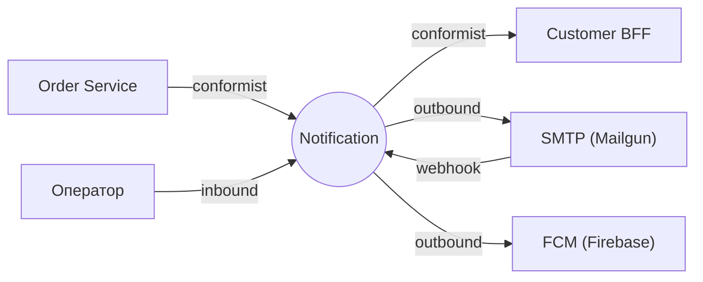
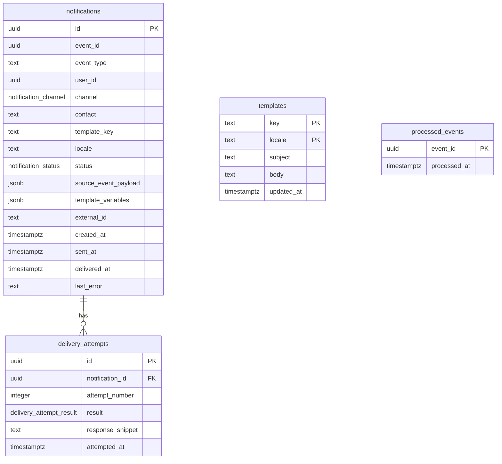

# Notification Service — Use Case спецификация (Уровень 1)

Уровень 1: слоёная архитектура (Controller → Service → Repository) без UseCase Pattern и DDD. **Агрегатов нет** (anemic, CRUD-сервис). Домен-юнит — сущность **Notification** — в [`aggregates/notification.md`](aggregates/notification.md); этот файл — секции контекста. §Доменные события (публикация) и §Процессы — «не применимо». Задача сервиса — взять входящее событие Order, отрендерить шаблон, отправить во внешний канал, записать результат.

---

## 1. Bounded Context

**Контекст:** Notification (на Уровне 1 — **модуль**, не отдельная предметная область). **Субдомен:** Generic. **Владелец:** команда «Платформа». Агрегатов нет.

### Домен-юниты

| Юнит | Назначение | Файл |
|---|---|---|
| `Notification` (сущность) | запись журнала доставки: событие → канал → адресат, со статусом | [`aggregates/notification.md`](aggregates/notification.md) |

**Внутри границы:** подписка на доменные события Order; выбор каналов по типу события; рендер шаблона и отправка через SMTP + FCM; журнал попыток; ретраи при временных ошибках; приём webhook'ов о доставке; админ-журнал и ручной retry.

**Вне границы:** бизнес-логика маркетплейса (правила «когда слать» — в источнике события); настройки подписок/опт-ауты (Уровень 2); кампании/массовые рассылки (отдельный сервис — здесь только транзакционные); токены устройств (берёт у Customer BFF); тело письма после отправки (только метаданные).

---

## 2. Интеграции (Context Map)

| Ребро | Направление | Канал | Связь | Передаётся |
|---|---|---|---|---|
| Order Service | inbound | async | conformist | события `marketplace.orders.v1` |
| Customer BFF | outbound | sync | conformist | `GET /users/{id}/contact` — email, push-токены, locale |
| SMTP (Mailgun) | bidirectional | sync + webhook | внешний | отправка письма; webhook `delivered`/`bounced` |
| FCM (Firebase) | outbound | sync | внешний | push (fire-and-forget) |
| Admin UI | inbound | sync | customer-supplier | журнал, ручной retry |

Notification — **Conformist** к контрактам Order и Customer BFF: подстраивается, не диктует. ACL на Уровне 1 избыточен.

### Контракты

| Контракт | Формат | Файл | Владелец |
|---|---|---|---|
| События Order (consume) | AsyncAPI | контракт контекста Order (`marketplace.orders.v1`) | Order |
| Customer BFF API (consume) | OpenAPI | контракт контекста Customer BFF | Customer BFF |
| Notification REST (admin + webhook) | OpenAPI | `contracts/notification-api.openapi.yaml` | Notification |

---

## 3. Ubiquitous Language

| Термин | В коде | Определение |
|---|---|---|
| Уведомление | `Notification` | Запись журнала: одно событие, одна попытка в один канал одному адресату. |
| Канал | `Channel` | `EMAIL`, `PUSH` (на запуске); `SMS` — расширение. |
| Адресат | `Recipient` | `userId` + материализованный контакт на момент отправки. |
| Шаблон | `Template` | Сообщение в БД: ключ + язык + субъект и тело с `${var}`. |
| Исходное событие | `SourceEvent` | Входящее Kafka-событие (JSON хранится для дебага/retry). |
| Статус доставки | `DeliveryStatus` | `QUEUED`/`SENT`/`DELIVERED`/`BOUNCED`/`FAILED`. |

Намеренно нет агрегатов, value objects, доменных событий — `Notification` это строка в таблице.

---

## 4. Роли и доступ

| Роль | Кто |
|---|---|
| `support-operator` | оператор поддержки (Keycloak) |
| `system` | SMTP-провайдер (webhook, HMAC), Customer BFF (s2s) |

ABAC отсутствует — оператор видит все уведомления. Покупатели прямого доступа не имеют (inbox — через Customer BFF, s2s). Доступ по операциям — [`aggregates/notification.md` → Доступ](aggregates/notification.md#3-доступ).

**PII:** email/push-токен — шифрование хранения; в логах маскируются; TTL 90 дней (`BR-N8`).

---

## 5. Доменные события

**Не применимо на Уровне 1.** Сервис событий не публикует — только потребляет события Order (см. §Интеграции).

---

## 6. Use Cases

**UC-N1 Подтверждение заказа → email + push.** `OrderConfirmed` → проверка `event_id` → контакт у BFF → две записи `QUEUED` (`BR-N2`) → отправка → email `SENT` → webhook → `DELIVERED`; push `SENT`.

**UC-N2 Провайдер 503 → retry.** 3 попытки (`BR-N5`) → `FAILED` + алёрт → оператор `RetryNotification` → успех.

**UC-N3 Невалидный адрес → bounced.** email `SENT` → webhook `bounced` → `BOUNCED`.

**UC-N4 Разбор оператора.** Жалоба → фильтр по `userId` → запись `BOUNCED` → детали → ответ.

---

## 7. Процессы

**Не применимо на Уровне 1.** Межсервисных процессов (Saga) нет — каждое событие обрабатывается независимо.

---

## 8. UI-спецификация

Один интерфейс — админ-журнал для `support-operator` (пользователи inbox видят через Customer BFF).

- **Журнал** (`/admin/notifications`): фильтры, таблица (дата/получатель/канал/тип/статус/действия), пагинация, счётчики.
- **Детали** (`/admin/notifications/{id}`): поля + `source_event_payload` + `delivery_attempts`; Retry/Abandon (если `FAILED`).

| Код ошибки | Текст оператору |
|---|---|
| `INVALID_STATUS_FOR_RETRY` | Можно ретраить только FAILED-уведомления. |
| `NOTIFICATION_NOT_FOUND` | Уведомление не найдено. |

---

## 9. Критерии приёмки (Given / When / Then)

- **Given** событие Order из таблицы каналов · **When** консьюмер получил · **Then** записи в правильных каналах (`BR-N2`).
- **Given** обработанное событие · **When** Kafka доставляет дубль · **Then** второе не создаётся (`BR-N1`).
- **Given** отправленное письмо · **When** webhook `delivered`/`bounced` · **Then** `SENT` → `DELIVERED`/`BOUNCED`.
- **Given** webhook без валидной HMAC · **When** приём · **Then** `WEBHOOK_SIGNATURE_INVALID` (401).
- **Given** провайдер 5xx · **When** отправка · **Then** 3 ретрая → `FAILED`; 4xx → сразу `FAILED`.
- **Given** нет шаблона · **When** обработка · **Then** не создаётся + `notification_template_missing_total++`.
- **Given** уведомление `FAILED` · **When** `POST /retry` · **Then** `QUEUED`; на не-`FAILED` → 409.
- **Given** Customer BFF недоступен · **When** запрос контакта · **Then** `FAILED`; retry после восстановления BFF.

---

## 10. Нефункциональные требования

| Аспект | Требование |
|---|---|
| Производительность | до 500 событий/с → ~1000 уведомлений; p95 «событие → ушло в Mailgun» ≤ 5с; p99 ≤ 30с |
| Надёжность | at-least-once; идемпотентность консьюмера (`BR-N1`); потерянные `QUEUED` подберёт следующий запуск |
| Безопасность | HMAC всех webhook (timestamp от replay); PII шифруется + маскируется; TTL 90 дней; s2s к BFF через service-account JWT |
| Наблюдаемость | метрики created/status/provider_latency/template_missing/retry; алёрты `failed > 5/min`, `template_missing > 0`, `latency p99 > 10с`; трейс по `event_id`/`notification_id` |
| Эксплуатация | шаблоны без рестарта (кэш TTL ≤ 60с); новый провайдер = adapter; locale `ru`/`en` (32 шаблона) |

---

## 11. Техническая реализация

`java-21` · `spring-boot-3` · `spring-kafka` (консьюмер) · `spring-web` (webhook + admin) · `spring-security` (OAuth2 + HMAC-фильтр) · `postgresql-16` + `jooq` + `flyway` · Mailgun/FCM (REST) · `resilience4j` (CB/retry для BFF) · Micrometer/Prometheus · OpenTelemetry · JUnit5 + WireMock.

**Persistence — только jOOQ, только сгенерированные классы** (`BS-17`, на любом уровне). Postgres ENUM-типы (`notification_channel`/`notification_status`/`delivery_attempt_result`) → jOOQ генерит Java-enum. Уровень 1 — про отсутствие DDD/UseCase Pattern, не про упрощение persistence.

### Схема БД

**API-контракт ошибок** — RFC 9457 ProblemDetails: `NOTIFICATION_NOT_FOUND` (404), `INVALID_STATUS_FOR_RETRY` (409), `WEBHOOK_SIGNATURE_INVALID` (401). Внутренние (`TEMPLATE_MISSING`, `CONTACT_LOOKUP_FAILED`, `PROVIDER_UNAVAILABLE`) наружу не светят — пишутся в `last_error`.

**Расширения (Уровень 2/3):** подписки/опт-ауты, A/B-тексты, WebPush, кампании (отдельный сервис), динамический выбор каналов через админку.
