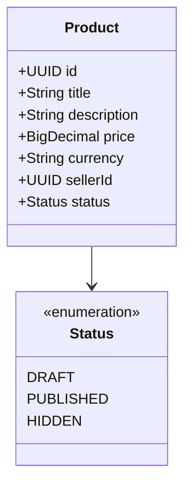
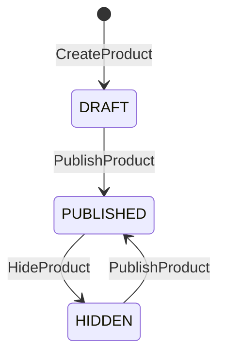

# Product (домен-юнит)

Сущность контекста Catalog. На Уровне 2 — **не DDD-агрегат** (нет aggregate root, инварианты проверяются в handler'е, не в модели); плоская модель. Контекст-секции (язык, роли, события-контракт, интеграции) — в [корне `catalog-spec.md`](../catalog-spec.md).

## 1. Доменная модель

Product — карточка товара продавца. Плоская модель (Уровень 2): отдельных сущностей и Value Object'ов нет, состояние — атрибуты карточки. Хранение (схема, типы) — [корень → Техническая реализация](../catalog-spec.md#11-техническая-реализация).

| Атрибут | Смысл |
|---|---|
| id | идентификатор товара (генерируется сервером) |
| title | название |
| description | описание |
| price | цена (> 0) |
| currency | валюта (RUB) |
| seller_id | владелец-продавец (логическая ссылка на Seller, без FK) |
| status | `DRAFT` \| `PUBLISHED` \| `HIDDEN` |
| created_at / updated_at | технические отметки времени |

Инварианты (полностью — [Бизнес-правила](#4-бизнес-правила)): цена > 0; валюта = RUB; идентификатор всегда серверный.

## 2. Жизненный цикл

| Статус | Смысл |
|---|---|
| `DRAFT` | создан продавцом, не виден Order и витрине |
| `PUBLISHED` | опубликован: виден витрине, доступен для заказа |
| `HIDDEN` | временно скрыт; можно опубликовать снова |

| Из | В | Триггер |
|---|---|---|
| (нет) | `DRAFT` | `CreateProduct` |
| `DRAFT` | `PUBLISHED` | `PublishProduct` |
| `HIDDEN` | `PUBLISHED` | `PublishProduct` |
| `PUBLISHED` | `HIDDEN` | `HideProduct` |

Удаление/архив не предусмотрены; при необходимости — отдельная команда и терминальный статус без переработки существующих.

## 3. Доступ

Роли и общие ABAC-правила — [корень → Роли и доступ](../catalog-spec.md#4-роли-и-доступ).

| Операция | seller (владелец) | admin | public | service-account |
|---|---|---|---|---|
| `CreateProduct` | ✅ (от своего имени) | ✅ | — | — |
| `PublishProduct` | ✅ только свой | ✅ любой | — | — |
| `HideProduct` | ✅ только свой | ✅ любой | — | — |
| `GetProduct` | ✅ (свой любой статус) | ✅ | ✅ только `PUBLISHED` | ✅ только `PUBLISHED` |
| `ListMyProducts` | ✅ только свои | ✅ | — | — |

Изменяющие команды и `ListMyProducts` ограничены владельцем (`seller_id` из токена); `admin` обходит. `GetProduct` для не-владельца/анонима/сервиса — только `PUBLISHED`.

## 4. Бизнес-правила

| Код | Тип | Правило | Команда | Ошибка |
|---|---|---|---|---|
| BR-P01 | инвариант | Цена обязательна и > 0 | CreateProduct | `INVALID_PRICE` |
| BR-P02 | инвариант | Валюта — только RUB | CreateProduct | `INVALID_CURRENCY` |
| BR-P03 | инвариант | Идентификатор всегда серверный (id от клиента не принимается) | CreateProduct | — |
| BR-P04 | предусловие | Публиковать/скрывать может только владелец; `admin` перебивает | PublishProduct, HideProduct | `OWN_PRODUCT_REQUIRED` |
| BR-P05 | предусловие | Переходы: Publish из `DRAFT`\|`HIDDEN`; Hide из `PUBLISHED` | PublishProduct, HideProduct | `INVALID_STATE_TRANSITION` |
| BR-P06 | предусловие | Публичное чтение по id — только `PUBLISHED`; `DRAFT`\|`HIDDEN` — «не найдено» | GetProduct | `PRODUCT_NOT_FOUND` |

## 5. Команды

### `CreateProduct`
- **Переход:** (нет) → `DRAFT`
- **Вход:** seller_id (из токена), title, description, price, currency
- **Предусловия:** цена > 0 (`BR-P01`); валюта RUB (`BR-P02`)
- **Логика:** серверный id (`BR-P03`); сохранить карточку в `DRAFT`; вернуть актуальный продукт
- **Ошибки:** `INVALID_PRICE`, `INVALID_CURRENCY`

### `PublishProduct`
- **Переход:** `DRAFT`\|`HIDDEN` → `PUBLISHED`
- **Вход:** product_id, seller_id (из токена)
- **Предусловия:** существует; владелец или `admin` (`BR-P04`); статус `DRAFT`/`HIDDEN` (`BR-P05`)
- **Ошибки:** `PRODUCT_NOT_FOUND`, `OWN_PRODUCT_REQUIRED`, `INVALID_STATE_TRANSITION`

### `HideProduct`
- **Переход:** `PUBLISHED` → `HIDDEN`
- **Вход:** product_id, seller_id (из токена)
- **Предусловия:** существует; владелец или `admin` (`BR-P04`); статус `PUBLISHED` (`BR-P05`)
- **Ошибки:** `PRODUCT_NOT_FOUND`, `OWN_PRODUCT_REQUIRED`, `INVALID_STATE_TRANSITION`

## 6. Доменные события

Product не публикует доменных событий (Уровень 2; см. [корень → Доменные события](../catalog-spec.md#5-доменные-события)).

## 7. Запросы

### `GetProduct`
- **Вопрос:** какие атрибуты и цена у товара по идентификатору?
- **Параметры:** product_id; контекст запрашивающего (владелец / admin / публичный)
- **Возвращает:** продукт если `PUBLISHED`; владельцу/`admin` — свой в любом статусе; иначе «не найдено»
- **Логика:** чтение по PK из `products`; правило видимости `BR-P06`; строгая согласованность (без Read Model)

### `ListMyProducts`
- **Вопрос:** какие товары у текущего продавца?
- **Параметры:** seller_id (из токена), status?, page, size
- **Возвращает:** страница товаров продавца (любые статусы)
- **Логика:** чтение из `products` по `seller_id` (+ опц. status), пагинация; Read Model нет
