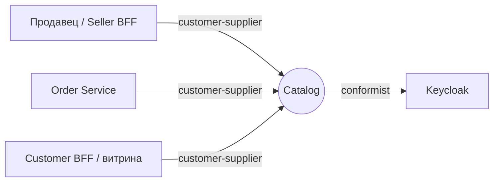
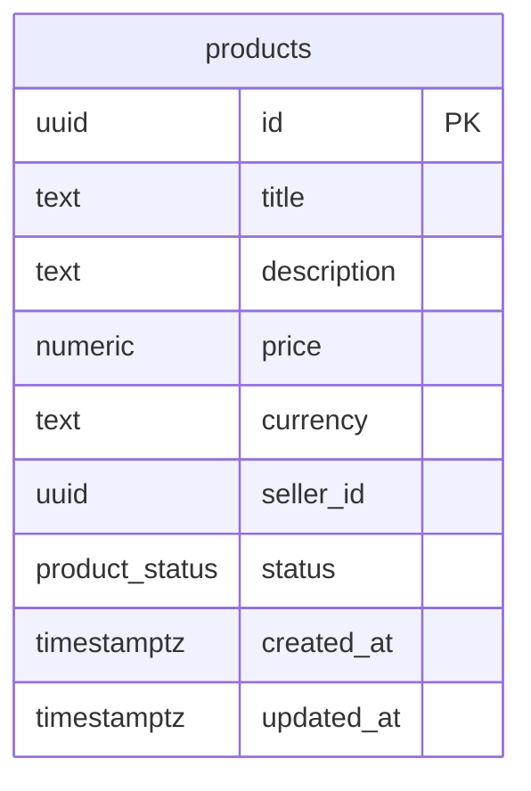

# Catalog Service — Use Case спецификация (Уровень 2)

Контекст **Catalog** маркетплейс-кейса: продавец заводит карточку товара, публикует, скрывает; Order Service берёт цену по `productId`. Уровень 2: `usecase-pattern` (UseCase + Handler с CQRS-маркерами), без DDD-агрегатов, доменных событий, саг и hexagonal-разделения. Агрегатов нет; домен-юнит — сущность **Product** — в [`aggregates/product.md`](aggregates/product.md). Этот файл — секции уровня контекста.

## 1. Bounded Context

**Контекст:** Catalog. **Субдомен:** Supporting — обслуживает основной flow заказа и витрину, но не несёт ядровую сложность маркетплейса. **Владелец:** команда «Каталог». **Миссия:** быть единственным владельцем концепта Product и его жизненного цикла.

### Домен-юниты

| Юнит | Назначение | Файл |
|---|---|---|
| `Product` (сущность) | Карточка товара продавца со статусом `DRAFT → PUBLISHED ↔ HIDDEN` | [`aggregates/product.md`](aggregates/product.md) |

### В границе контекста

- Создание / публикация / скрытие карточек товаров.
- Контроль перехода `DRAFT → PUBLISHED ↔ HIDDEN`.
- Хранение базовых атрибутов: title, description, price, currency, seller, status.
- Синхронная выдача цены по `productId` (для Order Service).
- Личный кабинет продавца: «мои продукты».

### Вне границы

- **Витрина покупателя** — публичный листинг, поиск, категории, фото, отзывы (Customer BFF / storefront).
- **Категории** — затёрли бы границу с витриной; в скоупе кейса не нужны.
- **Остатки / склад** — Inventory Service.
- **Фото и файлы** — Media Service.
- **Поиск по тексту** — Elasticsearch / OpenSearch.
- **Аутентификация** — IdP (Keycloak).

### Стыки с соседями

| Сосед | Тип связи | Суть |
|---|---|---|
| Order Service | customer-supplier (Catalog — supplier) | читает цену опубликованного товара |
| Seller BFF / Customer BFF | customer-supplier (Catalog — supplier) | команды продавца + чтение карточки |
| Keycloak | conformist | Catalog принимает контракт токена как есть |

## 2. Интеграции (Context Map)

| Ребро | Направление | Канал | Связь | Контракт |
|---|---|---|---|---|
| Order Service → Catalog | inbound | sync | customer-supplier (ohs) | [`catalog.openapi.yaml`](../../src/main/resources/openapi/catalog.openapi.yaml) |
| Seller/Customer BFF → Catalog | inbound | sync | customer-supplier (ohs) | [`catalog.openapi.yaml`](../../src/main/resources/openapi/catalog.openapi.yaml) |
| Catalog → Keycloak | outbound | sync | conformist | OIDC / JWKS |

### Контракты

- REST (входящий, владелец — Catalog): `src/main/resources/openapi/catalog.openapi.yaml`.
- Async: **нет**. Catalog не публикует доменных событий и не подписывается — Kafka-топиков нет (см. [Доменные события](#5-доменные-события)).

## 3. Ubiquitous Language

| Термин | Определение |
|---|---|
| **Product** | Карточка товара конкретного продавца. Один iPhone у двух продавцов — два разных Product; склейки SKU нет. |
| **Seller** | Продавец маркетплейса. У продукта ровно один owner-seller. |
| **Status** | Состояние карточки: `DRAFT`, `PUBLISHED`, `HIDDEN`. Перевод — отдельная команда. |
| **Опубликованный товар** | Product в `PUBLISHED` — единственное состояние, видимое Order Service и витрине. |

**Намеренно нет:** Category (см. [границы](#1-bounded-context)); Aggregate / Value Object / Domain Event / Saga — это Уровень 3, в Catalog избыточно (модель плоская).

## 4. Роли и доступ

| Роль | Кто это |
|---|---|
| `seller` | продавец; работает только со своими продуктами |
| `admin` | те же операции для любого продавца (перебивает ABAC) |
| `public` (без auth) | анонимный читатель — только опубликованная карточка |
| `service-account` | сервис-к-сервису (Order Service) — чтение опубликованной карточки |

**Общий ABAC:** идентификатор продавца из токена (`sub`) сравнивается с владельцем продукта; несовпадение на изменяющих операциях — «не найдено» (не раскрываем существование чужого). `admin` обходит. Доступ по операциям — в матрице [`aggregates/product.md` → Доступ](aggregates/product.md#3-доступ).

**PII:** Catalog не хранит персональные данные — только бизнес-атрибуты товара и идентификатор продавца.

## 5. Доменные события

**Не применимо на Уровне 2.** Catalog не публикует доменных событий и не подписывается. Изменения статуса соседи наблюдают синхронно через REST.

## 6. Use Cases

### UC-C1 — Продавец заводит и публикует продукт

**Актор:** seller. **Поток:** заполняет форму → `CreateProduct` (карточка `DRAFT`, серверный id) → проверяет превью → `PublishProduct` (проверка владельца и перехода, → `PUBLISHED`). **Альтернативы:** цена ≤ 0 / валюта ≠ RUB — отказ (`BR-P01`/`BR-P02`); публикация чужого — «не найдено» (`BR-P04`). Команды — [`aggregates/product.md`](aggregates/product.md#5-команды).

### UC-C2 — Order Service берёт цену

**Актор:** service-account (Order Service). **Поток:** для каждого товара `GetProduct` → цена и атрибуты, если `PUBLISHED`. **Альтернативы:** `DRAFT`/`HIDDEN`/нет — «не найдено» (`BR-P06`), Order не использует черновик.

### UC-C3 — Продавец временно скрывает продукт

**Актор:** seller. **Поток:** `HideProduct` (проверка владельца, `PUBLISHED` → `HIDDEN`) → Order и витрина перестают видеть. **Альтернативы:** скрытие не из `PUBLISHED` — недопустимый переход (`BR-P05`).

### UC-C4 — Чужой продавец меняет чужой продукт

**Актор:** seller (не владелец). **Поток:** публикация/скрытие чужого → проверка владельца не проходит (`BR-P04`) → «не найдено» (существование чужого не раскрывается).

## 7. Процессы

**Не применимо на Уровне 2.** Кросс-юнит процессов и распределённых транзакций нет. Каждая команда — одна локальная транзакция.

## 8. UI-спецификация

Catalog собственного UI не показывает — работает за Seller BFF (кабинет) и Customer BFF (витрина).

| Статус | Бейдж | Смысл |
|---|---|---|
| `DRAFT` | «Черновик» | создан, не виден покупателям и заказам |
| `PUBLISHED` | «Опубликован» | виден витрине, доступен для заказа |
| `HIDDEN` | «Скрыт» | временно снят, можно опубликовать снова |

| Ситуация | Текст пользователю |
|---|---|
| Товар не найден / чужой / не опубликован | Товар не найден. |
| Недопустимый переход статуса | Действие недоступно в текущем статусе товара. |
| Некорректная цена | Цена должна быть больше нуля. |
| Неподдерживаемая валюта | Поддерживается только рубль (RUB). |

Публичный листинг PUBLISHED — не ответственность Catalog (агрегация/кэш на стороне Customer BFF).

## 9. Критерии приёмки

| AC | Given / When / Then |
|---|---|
| AC-C1 | **Given** продавец; **When** создаёт товар; **Then** карточка `DRAFT` с серверным id. |
| AC-C2 | **Given** свой товар `DRAFT`/`HIDDEN`; **When** публикует; **Then** `PUBLISHED`. |
| AC-C3 | **Given** свой товар `PUBLISHED`; **When** скрывает; **Then** `HIDDEN`. |
| AC-C4 | **Given** чужой товар; **When** не-владелец публикует/скрывает; **Then** «не найдено». |
| AC-C5 | **Given** уже `PUBLISHED`; **When** публикуют повторно (или скрывают не из `PUBLISHED`); **Then** «недопустимый переход». |
| AC-C6 | **Given** создание; **When** цена ≤ 0 / null; **Then** «некорректная цена». |
| AC-C7 | **Given** товар; **When** публичное чтение по id; **Then** данные при `PUBLISHED`, иначе «не найдено». |
| AC-C8 | **Given** продавец; **When** «мои товары»; **Then** только свои (любых статусов), с пагинацией. |
| AC-C9 | **Given** реальный Catalog; **When** Order запрашивает цену по `productId`; **Then** интеграционный smoke-тест зелёный. |

## 10. Нефункциональные требования

| Атрибут | Цель |
|---|---|
| Производительность (чтение) | `GetProduct` p95 ≤ 50ms; критично — Order дёргает в цикле |
| Производительность (запись) | публикация p95 ≤ 100ms |
| Капасити | ~100 RPS чтение, ~5 RPS запись |
| Доступность | stateless, горизонтальное масштабирование без шардирования |
| Согласованность | строгая в транзакции команды; межсервисная — read-time (синхронно) |
| Безопасность | JWT (OAuth2 Resource Server); ABAC по владельцу; PII нет; TLS обязателен |
| Наблюдаемость | метрики создания/переходов, латентность чтения; `productId`/`sellerId`/`requestId` в логах; трейсинг |
| Эксплуатация | миграции без рестарта; один экземпляр держит стартовую нагрузку |

## 11. Техническая реализация

Единственный технический раздел; всё выше — домен.

**Контейнеры (C2):** один контейнер — Spring Boot Catalog; внешнее состояние — PostgreSQL; внешняя зависимость — Keycloak (JWKS).

| Слой | Стек | Реализация |
|---|---|---|
| Платформа | Java 21, Spring Boot 3.4.x | single-module, без hexagonal |
| REST | Spring Web | контроллеры реализуют операции OpenAPI; маппинг DTO ↔ UseCase; ABAC через `@PreAuthorize` |
| Безопасность | Spring Security, OAuth2 Resource Server | JWT по JWK Keycloak; роли из `realm_access.roles`; профили `local`/`integration-test` — `permitAll` |
| Бизнес-операции | `ru.vikulinva:usecase-pattern` | `UseCaseCommand`/`UseCaseQuery` (record) + `UseCaseHandler` (`@Component`, `@Transactional`) + `UseCaseDispatcher`; валидация в compact-конструкторе |
| Persistence | spring-boot-starter-jooq, nu.studer.jooq 10.x | **только jOOQ, только generated** (`ProductsPojo`, generated enum) — `BS-17/18` |
| БД | PostgreSQL 16, Liquibase | схема через `migrations/db/changelog/v-X.Y/` |
| Ошибки | RFC 9457 ProblemDetails | `@RestControllerAdvice` маппит доменные исключения |
| Наблюдаемость | Micrometer + Prometheus, OpenTelemetry | метрики и span'ы |
| Тесты | JUnit 5 + Testcontainers | против реального Postgres |

Resilience4j подключён под возможные будущие outbound; в текущем скоупе Catalog ходит только в IdP. Group `ru.remodov`.

### Коды ошибок → HTTP

| `code` | HTTP | Когда |
|---|---|---|
| `PRODUCT_NOT_FOUND` | 404 | продукт не существует / `DRAFT`\|`HIDDEN` при публичном чтении |
| `OWN_PRODUCT_REQUIRED` | 404 | изменение чужого продукта (404, не 403 — не раскрываем существование) |
| `INVALID_STATE_TRANSITION` | 409 | публикация уже `PUBLISHED`, скрытие не из `PUBLISHED` |
| `INVALID_PRICE` | 400 | `price ≤ 0` |
| `INVALID_CURRENCY` | 400 | валюта ≠ RUB |

### Схема БД

Одна таблица `products`. Индекс по `seller_id` (для «мои товары»); чтение по `id` — по PK. Цена и валюта — два поля (`BigDecimal` + `String`); Value Object `Money` не вводится (Уровень 2). Read Model нет.
